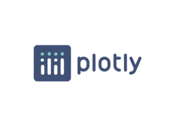

># Librerias y Frameworks de python 
## *Usos en analisis de datos*
La ciencia de datos es un campo que se ha beneficiado enormemente del uso de Python y sus librerías especializadas.
Algunas de las librerías más populares en este campo incluyen : 

>### **Bibliotecas principales** 

- **NumPy :** utilizada para realizar operaciones matemáticas complejas y para procesar matrices de datos. 

- **Pandas :** es una librería que se utiliza para manipular y analizar datos donde suelen estar en diferentes formatos y necesitan ser procesados y analizados antes de ser utilizados.

- **SciPy :** es la biblioteca de software para operaciones científicas como Álgebra Lineal, Estadística, Optimización, etc. 

> ### **Visualización de los datos**
- **Matplotlib :** Es una librería utilizada para crear gráficos y visualizaciones de datos.

- **Plotly :** es una biblioteca de visualización de datos interactiva basada en la web. Para poder usar esta librería, incrustado en cuadernos Jupyter y como una herramienta de línea de comandos independiente

- **Bokeh :** es una biblioteca de visualización para aquellos que quieren visualizaciones interactivas.

- **Seaborn :** es una biblioteca de visualización muy útil, pero se utiliza principalmente para visualizar modelos estadísticos.

